# Employee Management Platform

## 📌 Content

* [Overview](#overview)
    - [Purpose](#-projenin-amacı)
* [Solution Architecture](#solution-architecture)
* [Tech Stack](#tech-stack)
    - [Backend](#backend)
    - [Frontend](#frontend)
    - [Authentication & Authorization](#authentication--authorization)
    - [Database](#database)
    - [Cloud & Infrastructure](#cloud--infrastructure)
    - [DevOps](#devops)
* [System Architecture](#system-architecture)
    - [Layers](#layers)
    - [Traffic Flow](#traffic-flow)
    - [Diagram](#architecture-diagram)
* [Core Features](#core-features)
    - [Employee Management](#-employee-management)
    - [Department & Job Management](#-department--job-management)
    - [Advanced Filtering System](#-advanced-filtering-system)
    - [Sorting System](#-sorting-system)
    - [Pagination](#-pagination)
* [Authentication & Authorization](#authentication--authorization)
    - [Identity Management](#-identity-management)
    - [Authentication](#authentication-identity-verification)
    - [Token Flow Diagram](#-token-flow-diagram)
    - [Integration Architecture](#-integration-architecture)
    - [Security Model](#️-security-model)
* [Data Model](#data-model)
    - [Employee](#-employee)
    - [Job](#-job)
    - [Department](#-department)
    - [Location->Country->Region](#-location--country--region)
    - [Job History](#-jobhistory)
    - [Relations](#relations)
    - [Database Diagram](#-database-diagram-erd)
* [API Design](#api-design)
    - [Architectural Principles](#-architectural-principles)
    - [Request / Response Model](#-request--response-model)
    - [Data Transfer Strategy](#-data-transfer-strategy)
    - [Query Design](#-query-design)
    - [API Versioning Strategy](#-api-versioning-strategy)
    - [API Documentation](#-api-documentation)
    - [Sample API Structure](#-sample-api-structure)
* [Frontend Structure](#frontend-structure)
* [Security](#security)
* [Deployment](#deployment)
* [CI/CD](#cicd)
    - [Backend Pipeline](#backend-pipeline)
    - [Frontend Pipeline](#frontend-pipeline)
    - [Pipeline Characteristics](#pipeline-characteristics)
    - [CI/CD Flow Diagram](#cicd-flow-diagram)
* [Environment Configuration](#environment-configuration)
* [Local Setup](#local-setup)
    - [Repository Clone](#1️⃣-repository-clone)
    - [Environment Configuration](#2️⃣-environment-configuration)
    - [Container Services](#3️⃣-container-services)
    - [Backend](#4️⃣-backend)
    - [Frontend](#5️⃣-frontend)
* [Production Setup](#production-setup)
    - [Infrastructure Layer](#infrastructure-layer)
    - [Service Topology](#service-topology)
    - [Access Architecture](#access-architecture)
    - [Configuration Model](#configuration-model)
* [Screenshots](#screenshots-opsiyonel)

---

## Overview
A full-stack **Employee Management Platform**. A modern web application that brings together enterprise employee management, hierarchical organizational structure (manager-subordinate), advanced filtering and sorting mechanisms, historical work records, and management functions under a single system.

### 🎯 Purpose
This project was developed to experience full-stack architecture, a real production environment, AWS infrastructure, and deployment processes firsthand. The main objectives are:
- To establish a real **production environment**
- To experience the differences between **Development and Production** in practice
- To learn the end-to-end deployment process with AWS services
- To design a data model and system architecture that closely resembles real-world conditions

## Solution Architecture

The system architecture is designed with security, scalability, and sustainability in mind. The architecture is built on a layered system approach where the frontend, backend, authentication service, and cloud infrastructure operate separately but in an integrated manner.

The solution architecture is based on the following fundamental principles:

- **Layered Architecture:** Separation of Controller, Service, and Repository layers
- **Auth-first Design:** Placing authentication and authorization at the center of the system
- **Stateless Backend:** Session-independent backend structure with token-based authentication
- **Centralized Identity Management:** Management of authorization and role management through a central IAM service
- **Environment Separation:** Separation of development and production environments based on configuration
- **Cloud-native Design:** Positioning system components to work integrated with cloud services
- **Edge-level Routing:** Traffic management at the CDN layer

Thanks to this architectural structure, the system is designed to meet the following principles:
- Secure access model
- Scalable infrastructure
- Sustainable code structure
- Deployment architecture suitable for production environments

## Tech Stack

### Backend
- Java 17+  
- Spring Boot 3.x  
- Spring Security  
- OAuth2 Resource Server (JWT)  
- Spring Data JPA (Hibernate)  
- Specification API (Dynamic Filtering)  
- Pagination & Sorting  
- DTO Projection  
- Custom JPQL Queries  
- Flyway (Database Migrations)  
- Swagger / OpenAPI (springdoc-openapi)

### Frontend
- React  
- TypeScript  
- Vite  
- React Router  
- Tailwind CSS  
- Component-based Architecture  
- State-based Filter & Sort Management  
- Responsive Grid Layout  
- Axios  
- Axios Interceptors  
- AuthContext (Global Auth State)  

### Authentication & Authorization
- Keycloak  
- OAuth2 / OpenID Connect (OIDC)  
- JWT Authentication  
- Realm Roles & Role Mapping  
- Client Integration  
- Keycloak JS Adapter  

### Database
- PostgreSQL  

### Cloud & Infrastructure
- AWS EC2  
- AWS CloudFront (CDN + Routing Layer)  
- AWS S3  
  - Static Hosting (Frontend)  
  - Object Storage (User Uploads / Media Storage)  
- AWS RDS (Managed PostgreSQL)  
- AWS Lambda  
- AWS SES (Email Service)

### DevOps
- Docker  
- Docker Compose  
- DockerHub (Image Registry)  
- Environment-based Configuration  

## System Architecture
The system is designed with a cloud-based, multi-layered, and service-decoupled architecture. All components are integrated within a centralized traffic architecture managed through a CDN-based routing layer, all under a single domain.

The architecture is built on a topology where the frontend, backend, authentication service, data layer, and storage layer operate separately but in a coordinated manner.

### Layers

**Frontend Layer**
- React-based Single Page Application (SPA)
- Static hosting on AWS S3
- Global access model served via CloudFront

**CDN & Routing Layer**
- AWS CloudFront
- Multi-origin configuration
- Path-based routing:
- `/*` → Frontend (S3)
- `/api/*` → Backend API
- `/realms/*` → Keycloak
- Single domain architecture over HTTPS

**Backend Layer**
- Spring Boot REST API
- JWT-based stateless authentication
- Docker container structure
- Runs on AWS EC2

**Identity Layer**
- Keycloak (IAM service)
- OAuth2 / OpenID Connect-based authentication
- Centralized role and authorization management (RBAC)
- Runs as a container on AWS EC2

**Data Layer**
- PostgreSQL
- Managed database service (AWS RDS)

**Storage Layer**
- AWS S3
- Frontend static hosting
- Object storage for user uploads and media files

**Mail Layer**
- AWS Lambda
- AWS SES (email delivery service)
- Backend → Lambda trigger model

### Traffic Flow

1. User request logs into the system via CloudFront
2. The request is routed to the relevant origin according to the path information
3. Backend service performs JWT validation
4. Authentication and authorization processes are carried out via Keycloak
5. Data operations are performed at the database layer
6. Media operations are managed via S3 storage
7. The response is delivered to the user via the CDN layer
* Email Flow:
1. Backend triggers the relevant AWS Lambda function
2. Lambda → AWS SES enables email sending
3. Email is delivered

Thanks to this architecture, the system:
- Secure access from a single domain
- Centralized routing management
- Service separation
- Secure authentication infrastructure
- Scalable cloud architecture
- Production-compatible system topology

It is configured to meet these principles.

### Architecture Diagram


## Core Features

### 👤 Employee Management
- Employee CRUD operations
- Manager-Employee hierarchical relationship
- Role model (Manager / Non-Manager)
- Detailed modal view
- Sidebar-based edit/add panel

### 🏢 Department & Job Management
- Department-based filtering
- Job-based filtering
- Job-Employee relationship
- Number of employees per job (employeeCount)

### 🔍 Advanced Filtering System
- Text search (firstname, lastname, email)
- Department filter
- Job filter
- Manager filter
- Role filter
- Dynamic filter architecture (Specification API)

### 🔃 Sorting System
- Multi-field sorting support: - Hire Date
- Salary
- Updated At
- ASC / DESC toggle mechanism
- Frontend state-based sort management
- Dynamic mapping to backend `Sort` object

### 📄 Pagination
- Backend pageable Structure
- Frontend-controlled pagination
- Synchronous page management via API

## Authentication & Authorization
The system's authentication and authorization infrastructure is managed with a centralized architecture based on **Keycloak (IAM)**.

### 🔐 Identity Management
- Centralized identity management: **Keycloak**
- User, role, and authorization management is controlled from a single point
- Frontend and Backend layers are integrated via a common IAM

### Authentication (Identity Verification)
- OIDC (OpenID Connect) protocol
- JWT (JSON Web Token) based authentication
- Access Token + Refresh Token structure
- Stateless auth architecture
- Session-independent token-based authentication

### 🔁 Token Flow Diagram

```mermaid
sequenceDiagram
    autonumber
    participant User as Kullanıcı (Browser)
    participant KC as Keycloak (Auth)
    participant API as Backend (API)

    User->>KC: Kullanıcı Adı / Şifre
    KC-->>User: JWT Token (Erişim Anahtarı)
    
    User->>API: İstek + JWT Token (Header)
    
    Note over API: Token Geçerli mi?
    Note over API: Rolleri Uygun mu?

    API-->>User: Veri / Onay
```


### 🧩 Integration Architecture
- Frontend: OIDC client
- Backend: Resource server
- Keycloak: Authorization server

### 🛡️ Security Model
- Token validation
- Role claim parsing
- Automatic blocking of unauthorized access
- Stateless security architecture

## Data Model

### 👤 Employee
- Manager–Subordinate (self-reference) relationship
- Job, Department relationships
- Manager control
- Subordinates list
- Recursive loop prevention

### 🧑‍💼 Job
- Job CRUD
- Search via JobTitle

### 🏢 Department
- Department → Location relationship
- Department → Employee relationship

### 🌍 Location → Country → Region
- Multi-layered geographic model
- Region = Continents (continent based)

### 📜 JobHistory
- Employee-related job history
- Multiple job history support
- Access via employeeId
- Security control (ownership validation)

### Relations:

- Employee → Job  (ManyToOne)
- Employee → Department (ManyToOne)
- Employee → Manager (ManyToOne self-reference)
- Employee → Subordinates (OneToMany self-reference)
- Employee → JobHistory (OneToMany)
- JobHistory → Job (ManyToOne)
- Department → Location (ManyToOne)
- Location → Country (ManyToOne)
- Country → Region (ManyToOne)

### 📊 Database Diagram (ERD)


## API Design

### 🧱 Architectural Principles
- Stateless API structure
- Layered architecture (Controller → Service → Repository)
- DTO-based data transfer model
- Entity–DTO separation
- Validation layer (request validation)
- Global exception handling structure

### 🔁 Request/Response Model
- Standardized response structure
- Centralized error format
- HTTP status code standardization: 
- 200 / 201 → Success 
- 400 → Validation errors 
- 401 → Unauthorized 
- 403 → Forbidden 
- 404 → Not Found 
- 500 → Internal Server Error

### 📦 Data Transfer Strategy
- DTO projection
- Custom JPQL queries
- Lightweight response payloads
- Over-fetching / under-fetching prevention
- View-based response structure

### 🔍 Query Design
- Specification API based dynamic Filtering
- Pageable + Sort integration
- Multiple filter combinations
- Query parameter-based API design
- Backend-side filtering & sorting

### 🧭 API Versioning Strategy
- Versioned endpoint structure (`/api/v1/*`)

### 📑 API Documentation
- OpenAPI standard
- Swagger UI integration
- Auto-generated endpoint documentation

### 🔌 Sample API Structure
- /api/v1/employees
- /api/v1/departments
- /api/v1/jobs
- /api/v1/auth
- /api/v1/admin
- Swagger UI: /swagger-ui.html


## Frontend Structure
The frontend layer is built on a modular and scalable SPA architecture.
- Component-based architecture
- Feature-based folder structure
- Global layout structure
- Reusable UI component approach
- SPA routing with React Router
- Global auth state (AuthContext)
- Auth-guarded routes
- Public/private route separation
- Keycloak JS Adapter integration
- Centralized API client (Axios + interceptors)
- Responsive layout (TailwindCSS)
- Environment-based configuration structure

## Security
- OAuth2 / OpenID Connect-based authentication
- JWT-based stateless authentication
- Keycloak centralized identity management
- Role-Based Access Control (RBAC)
- Method-level authorization (`@PreAuthorize`)
- Route-level security (frontend + backend)
- All traffic over HTTPS / TLS
- CORS policy management
- Secure API access patterns

## Deployment

The application is deployed using a production-grade cloud architecture, and all services are managed from a single domain.

* Frontend: 
    - AWS S3 (Static Hosting) 
    - AWS CloudFront (CDN + HTTPS + Routing)

* Backend: 
    - Spring Boot API packaged as a Docker image 
    - Container-based deployment with Docker Compose on AWS EC2

* Database: 
    - PostgreSQL on AWS RDS 
    - Private network access within the same VPC with EC2 
    - Secure internal connectivity

* Identity Service: 
    - Dockerized Keycloak 
    - Container-based deployment with Docker Compose on AWS EC2 
    - Realm configuration import (pre-configured realm setup)

* Unified Access Layer: 
    - Centralized traffic management behind CloudFront 
    - Path-based routing: 
    - `/*` → Frontend (S3) 
    - `/api/*` → Backend API 
    - `/realms/*` → Keycloak

* Configuration Management: 
    - Environment variable based Structure
    - Secret management with `.env` file
    - Container-level config injection

- Security & Networking: - HTTPS termination (CloudFront)
- Single-domain architecture
- Solving mixed-content & CORS problems


## CI/CD
The system is managed with a deployment process based on pipeline logic.

### Backend Pipeline
- Artifact build with `mvn clean package`
- Image build via Dockerfile
- Push image to DockerHub registry
- Pull image on AWS EC2
- Image version update via `docker-compose.yml`
- Container-based redeploy

### Frontend Pipeline
- Production build with `npm run build`
- Deployment of `dist/` output to AWS S3 static hosting area
- AWS CloudFront `/*` invalidation
- CDN cache refresh + global propagation

### Pipeline Characteristics
- Versioned image deployment
- Immutable artifact approach
- Environment-independent build
- Controlled production release
- Zero-downtime CDN refresh

### CI/CD Flow Diagram


## Environment Configuration

System configuration is managed using an environment-based configuration model, separated between local and production environments.

- Local Environment:
    - Local variable management via `.env` file
    - Development-focused configuration structure
    - Local service endpoint definitions

- Production Environment:
    - Environment variable-based configuration on AWS EC2
    - Production secret management via `.env` file
    - Container-level config injection (Docker Compose)
    - Cloud environment compatible structure

- Configuration Principles:
    - Dev / Prod separation
    - Secret & config separation
    - Environment-agnostic application design

## Local Setup
To run the project locally, follow these steps.

### 1️⃣ Repository Clone
```bash
git clone <repo-url>
cd employee-management-platform
```

### 2️⃣ Environment Configuration
A .env file must be created in the root directory within both the backend and frontend:
```bash
# Backend
DB_URL=
DB_USER=
DB_PASS=
AWS_REGION=
AWS_S3_BUCKET_NAME=
AWS_S3_ACCESS_KEY=
AWS_S3_SECRET_KEY=
AWS_S3_DEFAULT_FILE=

# Frontend
VITE_API_BASE = 
VITE_PUBLIC_API = 
VITE_KEYCLOAK_URL = 
VITE_KEYCLOAK_REALM_NAME = 
VITE_KEYCLOAK_CLIENT_ID =
```
### 3️⃣ Container Services
```bash
docker-compose up -d
```
### 4️⃣ Backend
```bash
cd backend-api
mvn clean spring-boot:run
```
### 5️⃣ Frontend
```bash
cd frontend
npm install
npm run dev
```

## Production Setup

### Infrastructure Layer
- AWS EC2: 
- Backend and Keycloak services 
- Docker Compose orchestration
- AWS RDS: 
- Managed PostgreSQL database 
- Private network connection in the same VPC with EC2 
- Secure internal database access
- AWS S3: 
- Frontend static hosting 
- Media storage (file uploads)
- AWS CloudFront: 
-CDN 
- HTTPS termination 
- Central routing layer

### Service Topology
- Spring Boot API → Containerized (Docker Image)
- Keycloak IAM → Containerized (Docker Image)
- Frontend → Static build (S3 + CloudFront)
- Database → PostgreSQL (RDS / Container)

### Access Architecture
- Single-domain access model
- All service access via CloudFront
- Path-based routing: 
- `/*` → Frontend 
- `/api/*` → Backend 
- `/realms/*` → Keycloak

### Configuration Model
- Environment variable-based structure
- Production `.env` configuration management
- Container-level configuration injection
- Secret separation model


## Screenshots (opsiyonel)


